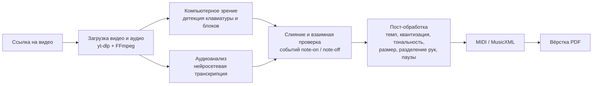

# Преобразование музыки в читаемый нотный лист

Наверняка вы заходили на платформу YouTube и смотрели видеоролики вот такого формата:


Такой формат называется **piano visualizer** (также встречается название «Synthesia-видео» — по имени программы Synthesia, которая его популяризировала). Экран видео поделён примерно на две части:

1) Нижнюю часть занимает фортепианная клавиатура, которая может быть как настоящей (съёмка сверху), так и чистой симуляцией. В момент звучания ноты соответствующая клавиша подсвечивается:
   
   

2) Верхняя часть представляет собой поток «падающих» блоков. Каждый блок — это одна нота, и вся информация о ней закодирована геометрией и цветом:
   - **горизонтальная позиция** блока указывает, над какой клавишей он находится, то есть **высоту ноты**;
   - **длина** блока пропорциональна **длительности** ноты;
   - **момент касания** блоком клавиатуры — это момент начала звучания (нажатия клавиши);
   - **цвет** блока обычно кодирует партию: левая рука / правая рука (или разные голоса).

   
   

Таким образом, piano visualizer — это, по сути, визуальная запись MIDI-событий: в каждом кадре видно, какие ноты звучат, когда они начались и когда закончатся. Именно это делает возможным обратную задачу — **восстановить из видео полноценный нотный текст**.

<hr>

## Основные понятия нотного листа

Чтобы понимать, что именно система должна получить «на выходе», кратко разберём устройство нотной записи.

### Нотный стан

**Нотный стан (нотоносец)** — основа записи музыки: пять горизонтальных линий, на которых и между которыми размещаются ноты. Чем выше нота расположена на стане, тем выше её звучание. В начале стана обязательно ставится **ключ** — знак, задающий «точку отсчёта» высоты:

- **скрипичный ключ** (ключ «соль») закрепляет за второй линией ноту соль первой октавы — в нём записывают верхний, мелодический регистр (обычно партию правой руки);
- **басовый ключ** (ключ «фа») закрепляет за четвёртой линией ноту фа малой октавы — в нём записывают нижний регистр (обычно партию левой руки).

Фортепианная музыка записывается сразу на **двух станах**, объединённых фигурной скобкой (акколадой): верхний — скрипичный ключ, нижний — басовый. **Тактовые черты** — вертикальные линии — делят запись на **такты**, равные доли музыкального времени. Размер такта задаётся **тактовым размером** (например, 4/4 — четыре четвертных доли в такте), который указывается после ключа.


### Соответствие клавиш и нот

Каждая клавиша фортепиано соответствует ровно одной ноте определённой высоты. Стандартная клавиатура содержит **88 клавиш** (52 белые и 36 чёрных) и охватывает диапазон от ля субконтроктавы (A0) до до пятой октавы (C8) — это чуть больше **семи октав**. Октава — интервал между двумя нотами с одинаковым названием (например, от до до следующего до); внутри октавы 7 основных ступеней (до, ре, ми, фа, соль, ля, си) и 5 производных (чёрные клавиши). Ноты, выходящие за пределы пяти линий стана, записываются на коротких **добавочных линиях** сверху или снизу. Ориентиром между двумя станами служит **до первой октавы** (middle C) — оно записывается на первой добавочной линии снизу в скрипичном ключе и на первой добавочной сверху в басовом.

Для нашей задачи это ключевое соответствие: определив **номер клавиши** по горизонтальной координате блока в видео, мы однозначно получаем **высоту ноты** и её место на стане.


### Длительность нот и пауз

Длительность ноты записывается формой её головки, наличием штиля и флажков: **целая** нота занимает весь такт 4/4, **половинная** — вдвое короче целой, далее **четвертная**, **восьмая**, **шестнадцатая** и т. д. — каждая следующая вдвое короче предыдущей. **Точка** справа от ноты удлиняет её в полтора раза; **лига** (дуга) связывает две одинаковые ноты в один непрерывный звук. Для каждой длительности существует парная **пауза** — знак молчания той же протяжённости. Паузы не менее важны, чем сами ноты: без них ритмический рисунок теряет смысл.

Важно, что нотная запись задаёт только **относительные** длительности. Абсолютное время звучания определяется **темпом** — количеством долей в минуту (BPM). Поэтому при распознавании видео недостаточно измерить длину блока в кадрах: нужно определить темп произведения и «уложить» измеренные длительности в музыкальную сетку (этот процесс называется **квантизацией**).


### Знаки альтерации и тональность

**Знаки альтерации** изменяют высоту ноты:

- **диез (♯)** — повышает ноту на полтона;
- **бемоль (♭)** — понижает ноту на полтона;
- **бекар (♮)** — отменяет действие диеза или бемоля.

Знаки альтерации работают одинаково в любом ключе — и в скрипичном, и в басовом. Различают **случайные знаки**, которые ставятся перед конкретной нотой и действуют до конца такта, и **ключевые знаки**, которые выставляются один раз сразу после ключа и действуют на всё произведение.

Набор ключевых знаков определяет **тональность** — «систему координат» произведения с главной устойчивой нотой (тоникой). Всего используется 24 тональности (12 мажорных и 12 минорных); их соотношение наглядно изображается **квинтовым кругом**: например, до мажор не имеет ключевых знаков, соль мажор — один диез, фа мажор — один бемоль.

Для читаемости нот правильное определение тональности критично: одна и та же чёрная клавиша может быть записана и как диез, и как бемоль (например, фа♯ = соль♭). Если тональность определена неверно, нотный текст засоряется десятками случайных знаков и становится практически нечитаемым — это одна из главных проблем автоматической транскрипции.


### Прочие нотные знаки

Помимо нот и пауз, нотный текст содержит знаки, уточняющие исполнение: **динамические оттенки** (p — тихо, f — громко, crescendo/diminuendo — постепенное усиление/ослабление), **штрихи** (staccato — отрывисто, legato — связно), обозначение **педали** (Ped.), **фермату** (продление звука), знаки **репризы** (повторения фрагмента) и др. Часть из них восстановима из видео: сила нажатия (velocity в терминах MIDI) видна по яркости/анимации клавиш и переводится в динамику, использование педали в некоторых визуализаторах отображается отдельной полосой.


<hr>

## Проблематика

Посмотрев такой ролик, человек, владеющий инструментом, естественно хочет выучить произведение — а для этого нужны ноты. Здесь и возникает разрыв:

1. **Ноты недоступны.** Авторы роликов, как правило, продают ноты через Patreon/Boosty или специализированные магазины; на бесплатных площадках полные ноты либо отсутствуют, либо распространяются с сомнительных сайтов (риск вредоносного ПО). Подбирать произведение «на глаз», прокручивая видео покадрово, — крайне трудоёмко.
2. **Языковой барьер.** Подавляющее большинство и роликов, и инструментов транскрипции ориентированы на англоязычную аудиторию; русскоязычных решений практически нет.
3. **Существующие открытые инструменты решают задачу лишь частично.** Они выдают «сырой» MIDI, а не готовые ноты; требуют скачивания видео и ручной калибровки; не определяют тональность, темп и размер; не разделяют партии рук. Подробный разбор — в следующем разделе.

<hr>

## Существующие решения и их недостатки

### Открытые проекты: видео → MIDI

| Проект | Подход | Недостатки |
|---|---|---|
| [svsdval/video2midi](https://github.com/svsdval/video2midi) (Python + OpenCV) | Распознаёт подсветку клавиш в скачанном видео, генерирует MIDI | Требует вручную скачать видео и откалибровать положение клавиш в интерфейсе; на выходе только сырой MIDI без темпа, тональности и разделения рук; интерфейс английский |
| [devbridie/synthesiavideo2midi](https://github.com/devbridie/synthesiavideo2midi) | OpenCV-анализ Synthesia-видео → MIDI | Проект заброшен, работает только с «идеальными» записями Synthesia; та же проблема сырого MIDI |
| [tangrs/synthesiavid2midi](https://github.com/tangrs/synthesiavid2midi), [Adelost/piano-video-2-midi](https://github.com/Adelost/piano-video-2-midi) | Аналогичные утилиты распознавания нажатий | Устаревшие, нет обработки ошибок распознавания, нет пост-обработки в ноты |

### Открытые проекты: аудио → MIDI

| Проект | Подход | Недостатки |
|---|---|---|
| [bytedance/piano_transcription](https://github.com/bytedance/piano_transcription) (+ [piano_transcription_inference](https://github.com/qiuqiangkong/piano_transcription_inference), GUI [PianoTrans](https://github.com/azuwis/pianotrans)) | Нейросетевая транскрипция аудио: ноты, velocity, педаль | Лучшая точность в классе, но выход — опять сырой MIDI: нет квантизации, тональности, размера, разделения рук; тяжёлая модель; только аудио — не использует видеоряд |
| [spotify/basic-pitch](https://github.com/spotify/basic-pitch) | Лёгкая универсальная нейросеть аудио → MIDI | Универсальность в ущерб точности на фортепиано; полифония распознаётся хуже специализированных моделей; MIDI без нотного оформления |
| Magenta Onsets & Frames (Google) | Исследовательская модель транскрипции фортепиано | Ориентирована на исследователей, порог входа высокий; сырой MIDI |

### Оформление нот и коммерческие сервисы

| Решение | Что делает | Недостатки |
|---|---|---|
| [MuseScore](https://musescore.org) (open source) | Импорт MIDI → нотный текст → PDF | Импорт *сырого* MIDI даёт нечитаемые ноты: случайная тональность, ошибочные длительности, всё в одном стане. Это инструмент вёрстки, а не решение задачи целиком |
| [Piano2Notes / Klangio](https://klang.io/piano2notes/) | Аудио/YouTube-ссылка → ноты (PDF, MusicXML, MIDI) | Закрытый платный сервис: бесплатно — только первые 20 секунд; нет русской локализации; качество квантизации на сложных произведениях нестабильно |
| AnthemScore | Аудио → ноты, десктоп | Платный, закрытый код, только аудио |

### Вывод

Ни одно из существующих решений не покрывает цепочку целиком: **открытые** проекты останавливаются на сыром MIDI и требуют ручной возни, а **полный** конвейер «ссылка → готовые ноты» существует только в закрытых платных сервисах — и без русской локализации. Кроме того, никто не использует **одновременно видеоряд и аудиодорожку**, хотя их совместный анализ позволяет взаимно проверять и исправлять ошибки распознавания.

<hr>

## Идея

Разработать настольное приложение с русской локализацией, реализующее полный конвейер: **ссылка на видеоролик → распознавание → MIDI → красиво свёрстанный нотный лист (PDF)**. Содержание нот должно максимально точно передавать звучание: высоты, длительности, паузы, темп, размер, тональность, динамику и разделение партий рук.



Этапы конвейера:

1. **Загрузка.** Пользователь вставляет ссылку; yt-dlp скачивает видео, FFmpeg разделяет его на видеоряд и аудиодорожку. Скачивать и калибровать что-либо вручную не требуется.
2. **Компьютерное зрение (C++ / OpenCV).** Автоматическая детекция области клавиатуры и разметка 88 клавиш; отслеживание подсветки клавиш и падающих блоков → поток событий «нота нажата / отпущена» с точными временными метками; цвет блоков → партия (левая/правая рука).
3. **Аудиоанализ (Python).** Параллельная нейросетевая транскрипция аудиодорожки и beat-tracking (определение темпа и сетки долей). Аудиоканал служит перекрёстной проверкой видеоканала: события, подтверждённые обоими источниками, считаются надёжными; расхождения разрешаются в пользу более уверенного канала. Это устраняет главную слабость чисто видеорешений — ошибки на низком битрейте, бликах и перекрытиях.
4. **Пост-обработка.** Квантизация длительностей к музыкальной сетке; определение тактового размера; определение тональности (профильный алгоритм Крумхансля–Шмуклера); корректная расстановка пауз; распределение нот по двум станам; перевод velocity в динамические оттенки.
5. **Экспорт.** Формирование MIDI и MusicXML (стандарт обмена нотной записью), затем автоматическая вёрстка в PDF через движок MuseScore/LilyPond.
6. **Интерфейс.** Настольное приложение (Qt) с полностью русской локализацией: вставил ссылку — получил PDF, при необходимости поправил параметры (темп, тональность) и пересобрал ноты.

<hr>

## Возможные проблемы и пути их решения

| № | Проблема | Путь решения |
|---|---|---|
| 1 | **Плохое качество видео**: низкое разрешение, низкий битрейт, артефакты сжатия — границы блоков и подсветка клавиш «плывут» | Адаптивные пороги бинаризации, сглаживание по нескольким кадрам; главное — перекрёстная проверка аудиоканалом: сомнительные события подтверждаются или отбраковываются по звуку |
| 2 | **Неполное изображение пианино**: кадр обрезан, часть октав отсутствует | Определение видимого диапазона по геометрии чередования чёрных/белых клавиш и достройка раскладки; ноты за кадром слышны в аудио — они восстанавливаются аудиоканалом |
| 3 | **YouTube в России доступен только через VPN**: скачивание по ссылке потребует от пользователя включённого VPN | Явное предупреждение в интерфейсе и настройка прокси прямо в приложении (yt-dlp это поддерживает); поддержка альтернативных платформ (VK Видео, Rutube) и запасной режим — открыть уже скачанный локальный файл |
| 4 | **Быстрые пассажи и низкий FPS**: при 30 кадрах/с временное разрешение ~33 мс — трели и короткие ноты сливаются | Межкадровая интерполяция движения блоков + onset-детекция по аудио (точность до ~10 мс) |
| 5 | **Разнообразие визуализаторов**: разные цветовые схемы, свечение, частицы, блики, водяные знаки поверх блоков | Автокалибровка по первым секундам ролика (HSV-анализ фона и блоков); при необходимости — обучаемый детектор вместо жёстких правил |
| 6 | **Живое исполнение с rubato**: темп «дышит», однозначной квантизации не существует | Beat-tracking по аудио; регулируемая жёсткость квантизации, чтобы пользователь выбирал между точностью и читаемостью |
| 7 | **Разделение рук**: цвета блоков не всегда кодируют руки (один цвет на всё, перекрещивание рук) | Если цвет неинформативен — эвристики по высоте и голосоведению (минимизация скачков внутри партии) |
| 8 | **Рассинхрон аудио и видео** в исходном ролике | Оценка постоянного сдвига кросс-корреляцией событий двух каналов перед слиянием |
| 9 | **Вычислительная сложность**: нейросетевая транскрипция тяжела для слабых ПК | Обработка офлайн (не в реальном времени), опциональное использование GPU, лёгкая модель как fallback |
| 10 | **Авторские права**: произведения и ролики защищены | Позиционирование результата как транскрипции для личного использования; ответственность за распространение — на пользователе |

<hr>

## Используемый стек и фреймворки


| Компонент | Назначение |
|---|---|
| **C++ + OpenCV** | Производительная обработка видеоряда: детекция клавиатуры, трекинг блоков и подсветки клавиш |
| **Python + NumPy** | Пост-обработка, склейка каналов, музыкальная логика |
| **yt-dlp + FFmpeg** | Загрузка видео по ссылке, извлечение кадров и аудиодорожки |
| **PyTorch + piano_transcription_inference** | Нейросетевая транскрипция аудио (перекрёстная проверка видеоканала) |
| **librosa** | Beat-tracking, определение темпа, onset-анализ |
| **mido / pretty_midi** | Формирование и обработка MIDI |
| **music21** | Построение MusicXML, алгоритмы определения тональности |
| **MuseScore CLI / LilyPond** | Автоматическая вёрстка MusicXML в PDF |
| **Qt (Qt Widgets / PySide6)** | Графический интерфейс, русская локализация |

## Запуск и проверка

Проект собирается по этапам, поэтому запустить можно то, что уже готово.

**Этап 2 — загрузка.** Ссылка или локальный файл превращаются в подготовленный видеоряд и аудиодорожку 16 кГц моно.

**Этап 3 — разбор видеоряда.** Клавиатура находится автоматически, ноты снимаются с подсветки клавиш и падающих блоков, партии рук разделяются по цвету. На синтетических роликах с точным эталоном — **F1 = 1.000 при нулевой ошибке начала ноты**; на 480p с шумом сжатия и свечением F1 остаётся выше 0.9.

Самый быстрый способ увидеть это своими глазами:

```bash
python scripts/vision_cli.py demo
```

Команда соберёт ролик из заранее известного списка нот, разберёт его, напечатает метрики и сохранит две картинки: найденную клавиатуру поверх кадра и сравнение эталона с результатом.

### Быстрый старт через Docker

> **Windows:** пишите команды одной строкой — обратный слеш `\` в CMD не переносит команду, а становится аргументом. Пути и ссылки всегда берите в кавычки.

Единственная зависимость — Docker. FFmpeg, Python и библиотеки уже внутри образа.

```bash
git clone https://github.com/TToJlkoBHuK/Music_Information_Retrieval.git
cd Music_Information_Retrieval

docker compose build
docker compose run --rm mir pytest tests             # 210 тестов, каждый видно отдельной строкой
```

Разбор ссылки без обращения к сети:

```bash
docker compose run --rm mir python -m scripts.ingest_cli url "https://www.youtube.com/watch?v=dQw4w9WgXcQ&list=PLabc&t=42"
```
```
Площадка:    youtube
Нормализация:https://www.youtube.com/watch?v=dQw4w9WgXcQ
Ключ кэша:   0424974c68530290
```

Подготовка локального файла (положите видео в `data/videos/` — папка примонтирована):

```bash
docker compose run --rm mir python -m scripts.ingest_cli fetch "data/videos/sample.mp4" -o data/output
```
```
Видео:       data/videos/sample.mp4
Аудио:       data/output/sample.wav
Кадры:       1920x1080 @ 29.970 fps
Всего кадров:    5524
```

Скачивание с YouTube (из России нужен прокси):

```bash
docker compose run --rm mir python -m scripts.ingest_cli fetch "https://youtu.be/VIDEO_ID" -o data/output --proxy socks5://host.docker.internal:1080
```

Для VK Видео и Rutube прокси не нужен.

### Локальная установка

Нужны Python 3.10+ и FFmpeg в `PATH`.

```bash
# Windows
winget install Gyan.FFmpeg
python -m venv .venv && .venv\Scripts\activate

# Linux
sudo apt install ffmpeg python3-venv
python3 -m venv .venv && source .venv/bin/activate

pip install -e ".[dev,docs]"
pytest tests -q
```

### Команды CLI

| Команда | Что делает |
|---|---|
| `url <ссылка>` | Площадка, нормализованная ссылка, ключ кэша. Без сети |
| `probe <источник>` | Название, длительность, разрешение. Без скачивания |
| `fetch <источник>` | Скачать и подготовить видео с аудиодорожкой |
| `cache` / `cache --clear` | Состояние и очистка кэша |

Флаги: `-v` подробный лог, `-q` без прогресса, `--proxy`, `--no-cache`, `--max-height`.

### Проверки качества

Подробности по тестам — в `docs/testing.md`.

```bash
ruff check mir tests scripts     # линтер
mypy mir                         # типизация, строгий режим (NF-16)
pytest --cov=mir                 # покрытие (NF-17)
```

Те же проверки выполняет GitHub Actions при каждом коммите, включая прогон на Windows.

### Документация

Собирается автоматически из README модулей и docstrings — разойтись с кодом не может.

```bash
mkdocs serve                     # http://127.0.0.1:8000
docker compose up docs           # то же самое в контейнере
```

При пуше в `master` документация публикуется на GitHub Pages.

<hr>

## Ожидаемый результат

Приложение, которое по одной ссылке на piano-visualizer-ролик выдаёт готовый к печати нотный PDF: верные высоты и длительности нот, расставленные паузы, корректные тональность, темп и размер, две партии на двух станах — без ручной калибровки, на русском языке и бесплатно.
